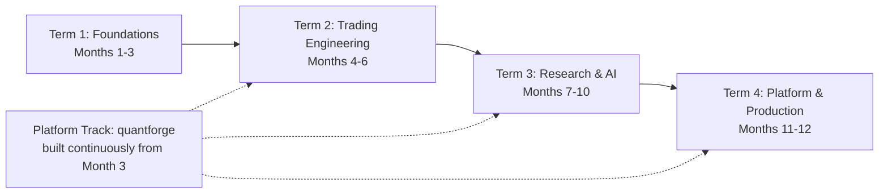

# Master in Financial Analysis and Algorithmic Trading (MFAAT)

| Item | Detail |
|---|---|
| Program fee | ₹10,00,000.00 (approx.) |
| Duration | 12 months (48 teaching weeks + 4 buffer/revision weeks) |
| Effort | ~12–15 hrs/week → ~650 guided hours + capstone |
| Level | Intermediate → Advanced (assumes comfort with advanced concepts) |
| Brokers | **Interactive Brokers (IBKR)** – TWS / IB Gateway via `ib_async` / `ibapi`  ·  **Alpaca** – `alpaca-py` (REST + WebSocket) |
| Markets | US equities & ETFs, indices, US equity/index options, CME futures, Forex (IB IDEALPRO), Crypto (Alpaca) |
| Regulatory scope | SEBI rules intentionally out of scope. Only broker-enforced account rules (margin, pattern-day-trader, market-data entitlements) are covered, because code must handle them. |
| Environment | Python 3.12+, JupyterLab, VS Code, Git, Docker, PostgreSQL/TimescaleDB, DuckDB, Parquet, Redis |

---

## 1. Design Philosophy (what makes this version better)

1. **Build-as-you-learn.** Every module ships code into one growing codebase (`quantforge`, the course trading platform). By month 12 students own a full platform, not 100 scattered notebooks.
2. **Notebook → Module → Service.** Ideas start in Jupyter, get promoted into tested library code, then wired into the live engine.
3. **Research rigor first.** Look-ahead bias, overfitting, transaction costs and multiple-testing corrections are taught *before* ML, so ML results can be trusted.
4. **Two brokers, one interface.** IB and Alpaca are wrapped behind a common `BrokerAdapter` interface (Adapter pattern), so every strategy runs on either broker, or on the simulator, unchanged.
5. **Risk is a gate, not an afterthought.** No order reaches a broker without passing the pre-trade risk engine and the kill switch.
6. **AI-augmented workflow.** LLMs, RAG, agents and n8n automation are used for research, monitoring and reporting, but never as an unchecked order source.

---

## 2. Program Architecture: 12 Parts, 4 Terms

| Term | Months | Parts | Outcome |
|---|---|---|---|
| **T1 Foundations** | 1–3 | P1 Markets & Economics · P2 Quant Toolkit · P3 Python Engineering | Understand markets deeply; write clean, tested, object-oriented Python |
| **T2 Trading Engineering** | 4–6 | P4 Broker Infrastructure · P5 Analytics Library · P6 Derivatives Engineering · P7 Strategy Library | Connect to IB and Alpaca, stream data, place and manage orders, build indicator, Greeks and strategy libraries |
| **T3 Research & AI** | 7–10 | P8 Backtesting, Risk & Portfolio · P9 Statistical Trading · P10 ML / DL / RL · P11 AI, NLP & Cowork | Produce statistically valid, optimized, risk-managed strategies, including ML/DL/RL-based ones |
| **T4 Platform & Production** | 11–12 | P12 Complete Trading Platform (LLD capstone) | A deployed, monitored, multi-broker platform running paper then small-size live |

---

## 3. Month-by-Month Roadmap

| Month | Theme | Core Parts | Platform Track Milestone | Graded Deliverable |
|---|---|---|---|---|
| 1 | Markets, Macro, Microstructure | P1 | – | Macro + microstructure research report; Excel option-payoff & BSM model |
| 2 | Quant Toolkit + Python Core | P2, P3.1–3.2 | – | Stats notebook: fat tails, stationarity and GARCH on 10 US tickers |
| 3 | OOP, LLD, Data Engineering | P3.3–3.6 | **M0** repo skeleton, domain models, config, logging | UML + domain model code review |
| 4 | Broker Connectivity (IB + Alpaca) | P4 | **M1** Broker adapters, data handler, OMS v1, kill switch | Paper-trade bracket orders on both brokers from one script |
| 5 | Analytics Library | P5 | **M2** Indicator, pattern and sentiment function groups | Library with ≥90% unit-test coverage |
| 6 | Futures & Options Engineering + Strategy Library | P6, P7 | **M3** Options chain, Greeks engine, strategy templates | Greeks engine validated against IB model Greeks |
| 7 | Backtesting & Optimization | P8.1–8.4 | **M4** Event-driven backtester + walk-forward optimizer | Tear sheet with walk-forward results and deflated Sharpe |
| 8 | Risk, Sizing, Portfolio + Statistical Trading | P8.5–8.8, P9 | **M5** Risk engine, sizing, portfolio optimizer, stat-arb module | Market-neutral pairs portfolio, backtested |
| 9 | Machine Learning for Trading | P10.1 | **M6** Feature store, labeling, ML pipeline | ML strategy with purged CV and meta-labeling |
| 10 | Deep Learning, RL, AI & NLP | P10.2–10.3, P11 | **M7** DL/RL research module, news & sentiment service, n8n alerts | RL agent in a custom Gym environment; RAG news copilot |
| 11 | Platform Integration | P12 | **M8** Strategy creator, screener, monitoring, audit, dashboard | Full platform demo on paper accounts |
| 12 | Production & Capstone | P12, capstone | **M9** Dockerized deploy, anomaly detection, live small-size trading | Capstone defense + 4 weeks of live/paper track record |

---

## 4. Detailed Curriculum

> Legend: 📘 theory · 🧪 lab (Jupyter) · 🧱 platform code · 📝 assessment

### PART 1 — Financial Markets & Economic Foundations (Month 1)

📄 **Detailed lesson plan:** [lessons/PART_01_MARKETS_ECONOMICS.md](lessons/PART_01_MARKETS_ECONOMICS.md)

| # | Module | Key Topics | Labs |
|---|---|---|---|
| 1.1 | **Macroeconomics for Traders** | GDP, inflation (CPI/PCE), employment (NFP), central banks and the FOMC, interest rates, yield curve and inversions, money supply and liquidity, business cycle, USD and FX drivers, commodities, intermarket analysis (bonds ↔ equities ↔ dollar ↔ gold), economic calendar trading | 🧪 Pull FRED data; build a macro regime dashboard |
| 1.2 | **Financial Markets & Instruments** | Equity, indices, ETFs, Forex, futures, options, bonds, crypto; exchanges (NYSE, Nasdaq, CME, CBOE), brokers, clearing, T+1 settlement, margin, short selling, market participants | 🧪 Instrument taxonomy mapped to IB contract types |
| 1.3 | **Stock Market Basics** | Order types, trading sessions (pre/post market), corporate actions (splits, dividends), financial statements, ratios, valuation primer (DCF, multiples), sectors and indices | 🧪 Fundamental screen on S&P 500 |
| 1.4 | **Market Microstructure** | Limit order book, bid/ask, spread, depth, NBBO, Reg NMS, maker/taker fees, payment for order flow (Alpaca), tick size, opening/closing auctions, HFT, adverse selection, Kyle and Glosten–Milgrom intuition, market impact | 🧪 Reconstruct a mini order book from L2 data; spread and impact stats |
| 1.5 | **Derivatives in Financial Markets** | Forwards vs futures, margin and mark-to-market, basis, contango/backwardation, rollover, options payoff, moneyness, put-call parity, arbitrage bounds | 🧪 Payoff diagrams; parity violation checker |
| 1.6 | **Futures & Options Basics and Strategies (conceptual)** | Long/short calls and puts, covered call, protective put, collar, verticals, straddle/strangle, butterflies, condors, calendars, diagonals, ratio spreads, synthetics | 🧪 Strategy payoff explorer |
| 1.7 | **Excel Primer for Finance** | Returns, CAGR, volatility, pivot tables, lookup, data tables, scenario analysis, Solver, BSM pricer in Excel; bridge to Python (`openpyxl`, `xlwings`) | 🧪 Excel BSM + Greeks sheet |
| 📝 | **Assessment** | Macro + microstructure research report; quiz | |

### PART 2 — Quantitative Toolkit (Month 2, first half)

📄 **Detailed lesson plan:** [lessons/PART_02_QUANT_TOOLKIT.md](lessons/PART_02_QUANT_TOOLKIT.md)

| # | Module | Key Topics |
|---|---|---|
| 2.1 | **Math for Quants** | Linear algebra (vectors, matrices, eigen-decomposition, PCA), calculus for optimization, gradient methods, convex optimization basics |
| 2.2 | **Statistics in Financial Markets** | Simple vs log returns, distributions, skew, kurtosis, fat tails, QQ plots, CLT, hypothesis testing, p-values and multiple testing, bootstrap, correlation vs causation, OLS regression, robust statistics |
| 2.3 | **Time-Series Econometrics** | Stationarity (ADF, KPSS), ACF/PACF, AR/MA/ARIMA, volatility clustering, ARCH/GARCH, cointegration (Engle–Granger, Johansen), Ornstein–Uhlenbeck process, Hurst exponent, regime detection (HMM), Kalman filter |
| 2.4 | **Performance & Risk Metrics** | CAGR, Sharpe, Sortino, Calmar, Omega, max drawdown, drawdown duration, VaR / CVaR (historical, parametric, Monte Carlo), beta, alpha, information ratio, tail ratio |

### PART 3 — Python Engineering for Trading (Months 2–3)

| # | Module | Key Topics |
|---|---|---|
| 3.1 | **Basic Python** | Types, control flow, functions, collections, comprehensions, files, exceptions, modules, virtual environments |
| 3.2 | **Advanced Python** | Iterators and generators, decorators, context managers, closures, type hints and `mypy`, `dataclasses` and `pydantic`, `asyncio` (essential for broker streams), threading vs multiprocessing, `numba`/vectorization, profiling (`cProfile`, `line_profiler`), memory management |
| 3.3 | **Object-Oriented Programming** | Classes, encapsulation, inheritance vs composition, abstract base classes, `Protocol`, dunder methods, properties, mixins, enums, immutability for domain objects |
| 3.4 | **Low-Level Design Principles** | SOLID, DRY, KISS, YAGNI; design patterns for trading: Strategy, Adapter (brokers), Factory (instruments/orders), Observer / event bus (market data), Command (orders), State (order lifecycle), Repository (data), Singleton (config), Chain of Responsibility (risk checks), Template Method (strategy base); UML class and sequence diagrams; clean/hexagonal architecture |
| 3.5 | **Scientific & Data Stack** | NumPy, pandas, Polars, SciPy, statsmodels, Matplotlib/Plotly, JupyterLab best practices |
| 3.6 | **Databases & Data Engineering** | SQL fundamentals, PostgreSQL + TimescaleDB for ticks/bars, DuckDB + Parquet for research, Redis for live state/cache, schema design (instruments, bars, ticks, orders, fills, positions), ETL, data validation |
| 3.7 | **Software Craft** | Git workflow, `pytest`, fixtures and mocks, property-based tests, logging, packaging (`pyproject.toml`, `uv`), linting (`ruff`), CI (GitHub Actions), Docker |
| 🧱 | **Platform M0** | Repo skeleton, domain models (`Instrument`, `Bar`, `Tick`, `Order`, `Fill`, `Position`), config, structured logging, error hierarchy |

### PART 4 — Broker Connectivity & Trading Infrastructure, in Jupyter (Month 4)

📄 **Detailed lesson plan:** [lessons/PART_04_BROKER_CONNECTIVITY.md](lessons/PART_04_BROKER_CONNECTIVITY.md)

*Maps to the original "Advance with Python" items 1–5, 39 and 40.*

| # | Module | Key Topics |
|---|---|---|
| 4.1 | **Environment Setup** | Install Python via `uv`/conda, JupyterLab, VS Code, required libraries, `.env` secret management, Docker image for the course, IB Gateway in Docker (IBC for auto-login) |
| 4.2 | **Interactive Brokers API** | TWS vs IB Gateway, `ibapi` (official) vs `ib_async` (maintained successor to `ib_insync`), contracts (`Stock`, `Future`, `ContFuture`, `Option`, `Forex`, `Index`, `Crypto`), `qualifyContracts`, market-data types (live/delayed/frozen), pacing limits, paper account, account/portfolio updates |
| 4.3 | **Alpaca API** | `alpaca-py` SDK, paper vs live, Trading/Data/Broker APIs, IEX vs SIP data feeds, WebSocket streams (trades, quotes, bars, trade updates), options and crypto trading, rate limits |
| 4.4 | **Fetching Data (Historical & Live)** | Historical bars/ticks from IB and Alpaca, pagination and pacing, live streaming, alternative sources for research (FRED, SEC EDGAR, vendor APIs), timezone/calendar handling (`exchange_calendars`), corporate-action adjustment, survivorship bias |
| 4.5 | **Connection Management** | Connection lifecycle, reconnection with back-off, heartbeats, event loops, subscription management, session state recovery, error-code handling (IB error codes, HTTP 429) |
| 4.6 | **Order Management in Python** | Market, limit, stop, stop-limit, trailing stop, bracket, OCO/OTO, time-in-force, extended hours, order lifecycle and state machine, partial fills, cancel/replace, client order IDs for idempotency, reconciliation with broker state |
| 4.7 | **Helper Files (Historical + Live Data)** | Unified `DataHandler` with resampling, caching, gap filling, bar builder from ticks, one API for backtest and live |
| 4.8 | **Kill Switch** | Cancel-all + flatten-all, daily max loss, max order rate, stale-data watchdog, broker disconnect handling, manual big red button (CLI/Telegram/n8n), post-mortem logging |
| 4.9 | **Multi-Asset: Equity, Forex, Futures** | Contract specs, multipliers, tick values, FX pip value and base/quote conversion, futures expiry and roll schedule, cross-currency P&L |
| 🧱 | **Platform M1** | `BrokerAdapter` (IB, Alpaca, Sim), `DataHandler`, OMS v1, kill switch |
| 📝 | **Assessment** | Same script sends and manages a bracket order on IB paper and Alpaca paper |

### PART 5 — Analytics Library: Patterns, Indicators, Sentiment (Month 5)

📄 **Detailed lesson plan:** [lessons/PART_05_ANALYTICS_LIBRARY.md](lessons/PART_05_ANALYTICS_LIBRARY.md)

*Original items 6–11 and 36–38.*

| # | Module | Key Topics |
|---|---|---|
| 5.1 | **Candlestick Patterns** | Rule-based detection of 30+ patterns (doji, engulfing, hammer, morning star, three soldiers…), parameterized thresholds, context filters (trend, volume), statistical edge testing of each pattern |
| 5.2 | **Technical Indicators (Simple)** | SMA, EMA, WMA, RSI, MACD, Bollinger Bands, ATR, Stochastic, OBV, VWAP |
| 5.3 | **Technical Indicators (Advanced)** | KAMA, Hull MA, SuperTrend, Ichimoku, ADX/DMI, Keltner, Donchian, Choppiness, Fisher Transform, Ehlers filters, volume profile, market profile, anchored VWAP, multi-timeframe indicators |
| 5.4 | **Sentiment Indicators** | VIX and term structure, put/call ratio, advance/decline, % above 200-DMA, new highs/lows, COT report, short interest, AAII, fear & greed composites |
| 5.5 | **Chart Pattern Identifier** | Swing/pivot detection (ZigZag, fractals), support/resistance clustering, trendlines, head & shoulders, double top/bottom, triangles, flags, wedges, cup & handle, harmonic patterns |
| 5.6 | **Other Useful Functions** | Crossover/crossunder, gaps, inside/outside bars, new N-bar highs/lows, pivot points, Fibonacci levels, candle anatomy features |
| 5.7 | **News Analysis** | News APIs (Alpaca/Benzinga news, IB news), SEC filings, earnings calendars, event studies (abnormal returns) |
| 5.8 | **Sentiment Analysis (NLP)** | Lexicon (Loughran–McDonald), FinBERT, LLM-based scoring, entity linking to tickers, sentiment aggregation, decay |
| 5.9 | **Black Swan & Tail Events** | Fat tails, extreme value theory, historical crashes (1987, 2008, 2010 flash crash, 2020, 2022), tail hedging, stress testing |
| 🧱 | **Platform M2** | `lib/patterns`, `lib/indicators/*`, `lib/sentiment`, `lib/actions`; vectorized **and** streaming (incremental) implementations |

### PART 6 — Futures & Options Engineering (Month 6, first half)

📄 **Detailed lesson plan:** [lessons/PART_06_FUTURES_OPTIONS_ENGINEERING.md](lessons/PART_06_FUTURES_OPTIONS_ENGINEERING.md)

*Original items 12–16.*

| # | Module | Key Topics |
|---|---|---|
| 6.1 | **Futures Library** | Contract chains, continuous contracts (back-adjusted, ratio-adjusted), roll logic (volume/OI/calendar), basis and carry, micro futures, spreads (calendar, inter-market) |
| 6.2 | **Option Strike Library** | Chain retrieval (IB `reqSecDefOptParams`, Alpaca options), expiry selection (weekly/monthly, DTE), ATM/ITM/OTM, strike by delta, by premium, by % OTM, by standard deviation, liquidity filters (OI, spread) |
| 6.3 | **Option Greeks** | Black–Scholes–Merton, Black-76 for futures options, delta, gamma, theta, vega, rho, dividend adjustment, implied-volatility solvers (Newton–Raphson, Brent) |
| 6.4 | **Second-Order Greeks** | Vanna, volga/vomma, charm, veta, speed, zomma, color, ultima; practical use for hedging and risk |
| 6.5 | **Advanced Greek & Pricing Methods** | Binomial/trinomial trees, Bjerksund–Stensland for American options, Monte Carlo with variance reduction, finite differences, automatic differentiation for Greeks, volatility surface (SVI, SABR), skew and term structure, local vs stochastic volatility (Heston intro), portfolio-level Greeks aggregation |
| 🧱 | **Platform M3a** | `options/chain.py`, `options/greeks.py`, `options/surface.py`, `futures/roll.py` |

### PART 7 — Strategy Library (Month 6, second half)

📄 **Detailed lesson plan:** [lessons/PART_07_STRATEGY_LIBRARY.md](lessons/PART_07_STRATEGY_LIBRARY.md)

*Original items 17–28. Every strategy is documented with the same template: hypothesis → market regime → entry → exit → sizing → failure modes → expected metrics.*

**7A — Linear Strategy Groups (Stocks, ETFs, Futures, FX)**

| Group | Example Strategies |
|---|---|
| Directional Momentum | Time-series momentum, breakout of N-day high, MA/EMA trend systems, SuperTrend, Turtle, dual momentum, cross-sectional momentum |
| Range-Bound | Bollinger reversion inside range, RSI band trading, support/resistance fade, grid trading |
| Mean Reversion | Z-score reversion, IBS, RSI(2), short-term reversal, gap fade, VWAP reversion |
| Either-Way | Opening-range breakout, volatility-squeeze breakout, news/earnings straddle-style entries |
| Volatility | Volatility targeting, ATR-channel, VIX-regime switching, vol breakout |
| Mathematical | Kalman-filter trend, fractal/Hurst regime, Fourier/wavelet cycles, entropy filters |
| Statistical | Pairs trading, cointegration baskets, PCA residual stat-arb, seasonality, factor tilts |

**7B — Option Strategy Groups**

| Group | Example Strategies |
|---|---|
| Directional Momentum Options | Long calls/puts, debit spreads, back spreads, risk reversals |
| Range-Bound Options | Iron condor, iron butterfly, short strangle (defined-risk variants), calendars |
| Mean-Reversion Options | Credit spreads at extremes, ratio spreads, skew trades |
| Hedging Options | Protective puts, collars, put spreads, VIX calls, tail-risk ladders, delta hedging of portfolios |
| Either-Way Options | Long straddle/strangle, long iron condor, event (earnings) vol trades |
| Volatility Options *(added)* | Variance-risk-premium harvesting, term-structure calendars, dispersion (intro), gamma scalping |

🧱 **Platform M3b**: `strategy/base.py` (Template Method), strategy registry, YAML/JSON strategy configuration.

### PART 8 — Backtesting, Optimization, Risk & Portfolio (Months 7–8)

📄 **Detailed lesson plan:** [lessons/PART_08_BACKTESTING_RISK_PORTFOLIO.md](lessons/PART_08_BACKTESTING_RISK_PORTFOLIO.md)

*Original items 29–35.*

| # | Module | Key Topics |
|---|---|---|
| 8.1 | **Strategy Backtesting** | Vectorized vs event-driven, bar vs tick simulation, fill models, commission (IB tiered/fixed, Alpaca), slippage and spread models, borrow costs, corporate actions; frameworks compared (vectorbt, backtrader, NautilusTrader, custom engine) |
| 8.2 | **Backtesting Pitfalls** | Look-ahead, survivorship, data snooping, overfitting, unrealistic fills, ignoring capacity |
| 8.3 | **Backtest Analysis** | Tear sheets (`quantstats`), trade-level analytics, MAE/MFE, regime breakdown, Monte Carlo trade resampling, bootstrap confidence intervals |
| 8.4 | **Strategy Optimization** | Grid, random, Bayesian (Optuna), genetic algorithms, walk-forward analysis, combinatorial purged cross-validation (CPCV), deflated Sharpe ratio, probability of backtest overfitting (PBO), parameter stability heatmaps |
| 8.5 | **Risk Management** | Pre-trade checks, exposure limits (gross/net, sector, instrument), stop frameworks, drawdown circuit breakers, VaR/CVaR limits, Greeks limits, correlation risk, liquidity risk, operational risk |
| 8.6 | **Position Sizing** | Fixed fractional, fixed risk per trade (ATR-based), volatility targeting, Kelly and fractional Kelly, optimal f, pyramiding and scaling rules |
| 8.7 | **Portfolio Creation** | Strategy diversification, correlation clustering, multi-strategy capital allocation, rebalancing |
| 8.8 | **Portfolio Optimization** | Mean-variance, minimum variance, risk parity, Hierarchical Risk Parity (HRP), Black–Litterman, CVaR optimization (`riskfolio-lib`, `cvxpy`), robust covariance (Ledoit–Wolf shrinkage) |
| 🧱 | **Platform M4–M5** | Event-driven backtester sharing code with live engine; optimizer; risk engine; sizing; portfolio module |

### PART 9 — Advanced Statistical Trading (Month 8)

📄 **Detailed lesson plan:** [lessons/PART_09_STATISTICAL_TRADING.md](lessons/PART_09_STATISTICAL_TRADING.md)

*Original "Trade Creation" items 1–4.*

| # | Module | Key Topics |
|---|---|---|
| 9.1 | **Advanced Statistics in Financial Markets** | Stochastic processes (GBM, OU, jump diffusion), copulas, extreme value theory, regime-switching models, Bayesian inference |
| 9.2 | **Statistical Strategy Creation** | Pairs/cointegration, Kalman dynamic hedge ratio, PCA/eigen-portfolio stat-arb, factor models (Fama–French, custom), seasonality and calendar anomalies, lead–lag |
| 9.3 | **Advanced Statistical Strategy Analysis** | Half-life of mean reversion, structural breaks, stability tests, multiple-hypothesis correction (Bonferroni, BH-FDR, White's Reality Check) |
| 9.4 | **Statistical Strategy Optimization** | Robust parameter selection, ensemble of parameters, walk-forward re-estimation |

### PART 10 — Machine Learning, Deep Learning & Reinforcement Learning (Months 9–10)

📄 **Detailed lesson plan:** [lessons/PART_10_MACHINE_LEARNING.md](lessons/PART_10_MACHINE_LEARNING.md)

*Original "Trade Creation" items 5–16. Each group follows the same 4 steps: **Theory → Create Strategy → Advanced Analysis → Optimization**.*

| # | Group | Theory | Create Strategy | Advanced Analysis | Optimization |
|---|---|---|---|---|---|
| 10.1 | **Machine Learning** | Supervised/unsupervised, bias–variance, trees, Random Forest, XGBoost/LightGBM, SVM, clustering, feature engineering (fractional differentiation, microstructure features, technical features) | Triple-barrier labeling, meta-labeling, classification of direction, regime clustering, return forecasting | Purged k-fold and embargo, feature importance (MDI, MDA, SHAP), sample weighting, leakage audit | Hyperparameter search with Optuna under CPCV, bet sizing from probabilities, ensembling |
| 10.2 | **Deep Learning** | Neural nets, backprop, PyTorch, CNN, LSTM/GRU, TCN, Transformers for time series, autoencoders | Sequence forecasting, CNN on candlestick images, autoencoder anomaly signals, multi-task models | Walk-forward retraining, uncertainty (MC dropout, conformal prediction), explainability | Architecture search, regularization, early stopping, distillation for low-latency inference, ONNX export |
| 10.3 | **Reinforcement Learning** | MDPs, Bellman equations, Q-learning, DQN, policy gradients, PPO, SAC, reward shaping | Custom Gymnasium trading environment (costs, slippage, position limits), agents with `stable-baselines3`, RL for execution and hedging | Robustness across regimes, reward hacking detection, sim-to-real gap | Hyperparameter tuning, curriculum learning, ensemble agents |

🧱 **Platform M6–M7**: `research/ml`, `research/dl`, `research/rl`, feature store, model registry (MLflow).

### PART 11 — AI, NLP & Cowork in Trading (Month 10)

📄 **Detailed lesson plan:** [lessons/PART_11_AI_NLP_COWORK.md](lessons/PART_11_AI_NLP_COWORK.md)

*Expands original "Cowork in trading", "News analysis", "Sentiment analysis" and "Artificial intelligence".*

| # | Module | Key Topics |
|---|---|---|
| 11.1 | **LLMs for Market Research** | Prompting for financial analysis, structured extraction from earnings calls and 10-K/10-Q, summarization |
| 11.2 | **RAG for Finance** | Embeddings, vector databases (pgvector, Chroma), chunking filings and news, retrieval evaluation, citation-grounded answers |
| 11.3 | **AI Agents & Cowork** | Agentic research assistants, tool calling (market data, backtester as tools), AI pair-programming for strategy code, human-in-the-loop approvals, guardrails: an AI can *propose* trades, only the risk engine can *approve* them |
| 11.4 | **n8n Automation** | Workflows for daily pre-market briefs, news alerts → sentiment → Telegram/Slack, EOD P&L reports, kill-switch trigger webhook, error escalation |
| 11.5 | **Event & Crash Analysis** | Event-driven strategies (earnings, FOMC, CPI), crash / big-move / rare-event early-warning signals (volatility term-structure inversion, breadth collapse, credit spreads, ML anomaly scores) |

### PART 12 — Complete Trading Platform: LLD Capstone (Months 11–12)

📄 **Detailed lesson plan:** [lessons/PART_12_TRADING_PLATFORM_CAPSTONE.md](lessons/PART_12_TRADING_PLATFORM_CAPSTONE.md)

The full design, package map, interfaces and sprint plan are in **[03_PLATFORM_LLD_ROADMAP.md](03_PLATFORM_LLD_ROADMAP.md)**. Summary:

| Layer | Original Items |
|---|---|
| Core infrastructure (performance, memory, errors, latency) | 1, 2 |
| Domain services: users, brokers, data, environment | 3, 4, 5, 6 |
| Analytics library (helpers, patterns, indicator function groups, actions) | 8–17 |
| Trade logic library (entry, targets, stops, sizing, risk, adjustments, verification, journal, portfolio) | 18–26 |
| Strategy & screener layer | 27–29, 54 |
| Options & futures strategy layer | 30, 33–41 |
| Research layer (backtest, optimization, ML, DL, AI, stat-arb, news, rare-event) | 42–50 |
| Analytics & journal | 31, 32, 51 |
| Execution (spread-aware OMS) | 53 |
| Monitoring, audit & anomaly detection | 7, 52 |

**Production topics:** Docker Compose deployment, VPS/cloud hosting near broker gateways, secrets, scheduled jobs, Prometheus + Grafana metrics, structured logs, alerting, disaster recovery, daily reconciliation, paper → shadow → small-size live rollout.

---

## 5. Assessment Model

| Component | Weight |
|---|---|
| Weekly labs (Jupyter notebooks, auto-graded tests) | 20% |
| Monthly projects (12) | 25% |
| Platform milestone code reviews (M0–M9) | 20% |
| Research paper: one original strategy with full statistical validation | 10% |
| Capstone: platform demo + strategy portfolio + 4-week paper/live track record + viva | 25% |

**Graduation criteria:** platform passes the test suite, runs on IB and Alpaca paper accounts, the kill switch is demonstrated, and at least 2 strategies pass walk-forward validation and deflated-Sharpe checks.

---

## 6. What the ₹10,00,000 Program Includes (suggested value stack)

| Component | Suggested Allocation |
|---|---|
| ~300 hrs live instruction + ~350 hrs guided labs | Core |
| Weekly 1:1 mentor sessions (48 × 45 min) | Premium |
| Code reviews on every platform milestone | Premium |
| Data & infrastructure credits (market-data subscriptions, cloud VPS, GPU hours) for 12 months | Included |
| Complete `quantforge` platform source, notebooks and strategy library (lifetime access) | Included |
| Capstone demo day + alumni research community | Included |
| Career track: quant-developer interview prep, GitHub portfolio review | Included |

---

## 7. Toolchain Reference

| Area | Tools |
|---|---|
| Brokers | `ib_async`, `ibapi`, IB Gateway + IBC, `alpaca-py` |
| Data & storage | pandas, Polars, DuckDB, Parquet, PostgreSQL/TimescaleDB, Redis, ArcticDB (optional) |
| Analytics | NumPy, SciPy, statsmodels, `arch`, TA-Lib / `pandas-ta`, `py_vollib`, QuantLib |
| Backtesting | vectorbt, backtrader, NautilusTrader, custom event-driven engine |
| Optimization & portfolio | Optuna, `cvxpy`, `riskfolio-lib`, PyPortfolioOpt |
| ML/DL/RL | scikit-learn, LightGBM, XGBoost, PyTorch, `stable-baselines3`, Gymnasium, MLflow, SHAP |
| NLP & AI | Hugging Face (FinBERT), LLM APIs, pgvector/Chroma, LangGraph or custom agents, n8n |
| Engineering | Git, `uv`, `pytest`, `ruff`, `mypy`, Docker, GitHub Actions, FastAPI, Streamlit, Prometheus, Grafana |

---

## 8. Risk Disclaimer

This program is educational. Live trading involves substantial risk of loss. All strategies must be paper-traded and pass the platform's risk gates before any live capital is used.
