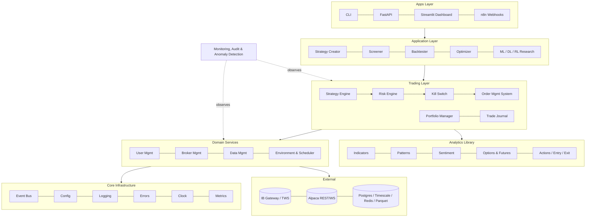
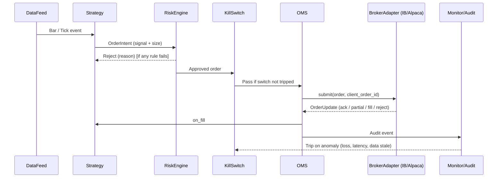

# Complete Trading Platform: Low-Level Design Roadmap

Codename: **`quantforge`**, the platform students build throughout the MFAAT program.
Brokers: **Interactive Brokers** and **Alpaca**, plus an internal **Simulator**, all behind one interface.

---

## 1. Design Goals & Non-Functional Requirements

| Goal | Requirement |
|---|---|
| **Same code, backtest & live** | Strategies depend only on abstract interfaces (`DataFeed`, `ExecutionGateway`, `Clock`), so backtest, paper and live are configuration switches. |
| **Broker-agnostic** | Adapter pattern: `IBAdapter`, `AlpacaAdapter` and `SimAdapter` implement `BrokerAdapter`. |
| **Safety** | Every order passes `RiskEngine` (chain of checks) → `KillSwitch` → `OMS` → adapter. Nothing bypasses it. |
| **Deterministic & auditable** | Event-sourced order/fill log; every decision is timestamped and replayable. |
| **Realistic latency** | Python + retail broker APIs: target < 50 ms from signal to order submit internally. Broker round-trip is outside our control (typically tens to hundreds of ms). This platform is not HFT. |
| **Resilience** | Auto-reconnect, state reconciliation on restart, stale-data watchdog, graceful degradation. |
| **Extensibility** | New indicator, strategy or broker = new class plus registry entry, with no edits to core (Open/Closed principle). |
| **Testability** | ≥ 90% coverage for `lib/`, contract tests for each broker adapter, golden-file tests for indicators. |

---

## 2. Layered Architecture



---

## 3. Package Layout (mapped to the original 54 roadmap items)

```text
quantforge/
├── core/                     # [1, 2] Core library & system handling
│   ├── config.py             #   pydantic-settings, per-environment profiles
│   ├── events.py             #   Event types + async EventBus (Observer)
│   ├── clock.py              #   LiveClock / SimClock
│   ├── errors.py             #   Exception hierarchy (BrokerError, RiskRejected, DataStale…)
│   ├── logging.py            #   Structured JSON logs, correlation IDs
│   ├── metrics.py            #   Latency timers, Prometheus exporters
│   ├── memory.py             #   Ring buffers, bounded caches, object pools
│   └── system.py             #   Health checks, graceful shutdown, signal handling
├── domain/                   # Pure domain models (immutable dataclasses)
│   ├── instrument.py         #   Equity, ETF, Index, Future, Option, FXPair, Crypto
│   ├── market.py             #   Tick, Quote, Bar, OrderBook
│   ├── order.py              #   Order, OrderState (State pattern), Fill
│   └── position.py           #   Position, Portfolio snapshot
├── users/                    # [3] User management: profiles, roles, API keys, risk profile
├── brokers/                  # [4] Broker management
│   ├── base.py               #   BrokerAdapter ABC
│   ├── ib/                   #   ib_async adapter, contract mapper, error-code map, pacing
│   ├── alpaca/               #   alpaca-py adapter, stream handler, rate limiter
│   └── sim/                  #   Simulated exchange (fill, slippage & latency models)
├── data/                     # [5] Data management
│   ├── historical.py         #   Fetch + cache (Parquet/DuckDB)
│   ├── live.py               #   Streaming feed, bar builder from ticks
│   ├── store.py              #   Repository pattern over Timescale / Parquet / Redis
│   └── clean.py              #   Validation, gap filling, outliers, corporate actions
├── env/                      # [6] Environment, automation, API & connection mgmt
│   ├── scheduler.py          #   Market-calendar-aware jobs (APScheduler)
│   ├── connections.py        #   Connection pool, reconnect/back-off, heartbeats
│   └── secrets.py            #   Vault/.env abstraction
├── lib/                      # Strategy building-block library
│   ├── helpers.py            # [8]  Common utilities (resample, align, rolling ops)
│   ├── patterns/candles.py   # [9]  Candlestick patterns
│   ├── patterns/charts.py    # [10] Chart patterns (pivots, H&S, triangles…)
│   ├── indicators/
│   │   ├── momentum.py       # [11] RSI, MACD, ROC, Stoch, CCI…
│   │   ├── volatility.py     # [12] ATR, BB, Keltner, HV, Parkinson, Garman–Klass
│   │   ├── price_volume_time.py # [13] VWAP, OBV, volume profile, time-of-day
│   │   ├── direction.py      # [14] MAs, ADX, SuperTrend, Ichimoku
│   │   ├── sentiment.py      # [15] VIX term structure, P/C ratio, breadth
│   │   └── levels.py         # [16] Spread, range, support/resistance, pivots
│   ├── actions.py            # [17] crossover, crossunder, gap, breakout, new high/low
│   ├── entry.py              # [18] Composable entry conditions (Specification pattern)
│   ├── targets.py            # [20] Fixed, R-multiple, ATR, S/R, trailing, time-based
│   ├── stoploss.py           # [21] Fixed, ATR, chandelier, swing, volatility, breakeven
│   ├── sizing.py             # [22] Fixed fractional, vol target, Kelly, risk-per-trade
│   ├── risk.py               # [23] Risk check rules (Chain of Responsibility)
│   ├── adjustments.py        # [24] Scale in/out, pyramiding, roll, re-hedge
│   ├── verification.py       # [25] Pre/post-trade verification & broker reconciliation
│   └── journal.py            # [26] Trade journal records & tagging
├── portfolio/                # [19] Portfolio management, allocation, rebalancing
├── strategy/
│   ├── base.py               # [27] Strategy (Template Method): on_bar/on_tick/on_fill
│   ├── creator.py            # [27, 54] Build strategies from config using lib functions
│   └── registry.py           #   Plugin registry (Factory)
├── screener/                 # [28, 29] Instrument selection & advanced screening
├── options/
│   ├── chain.py              # [30] Strike helpers: by delta / premium / σ / % OTM
│   ├── greeks.py             #   1st & 2nd-order Greeks, IV solvers
│   ├── surface.py            #   SVI/SABR vol surface
│   └── strategies/
│       ├── builder.py        # [33] Multi-leg option strategy builder
│       ├── bullish.py        # [34] Momentum bullish
│       ├── bearish.py        # [35] Momentum bearish
│       ├── sideways.py       # [36] Range-bound
│       ├── either_way.py     # [37] Either way / volatility
│       ├── sentiment.py      # [38] Sentiment & parameter-driven selection
│       ├── hedging.py        # [39] Portfolio hedges with futures & options
│       ├── advanced_math.py  # [40] Greeks-neutral, vol-arb, dispersion math
│       └── advanced.py       # [41] Dynamic adjustment & multi-expiry structures
├── execution/
│   ├── oms.py                # [53] OMS: lifecycle, routing, idempotency
│   ├── spread_aware.py       # [53] Limit placement from bid/ask, peg, chase, timeouts
│   ├── algos.py              #   TWAP, VWAP, POV, iceberg
│   └── killswitch.py         #   Global flatten, cancel-all, loss/latency triggers
├── research/
│   ├── backtest/             # [42] Event-driven backtester reusing live components
│   ├── optimize/             # [43] Grid / Bayesian / walk-forward / CPCV / DSR
│   ├── ml/                   # [44] Features, labeling, models, meta-labeling
│   ├── dl/                   # [45] PyTorch models, training loops, ONNX export
│   ├── ai/                   # [46] LLM agents, RAG, tool calling
│   ├── statarb/              # [47] Cointegration, Kalman, PCA baskets
│   ├── news/                 # [48, 49] News ingestion, sentiment, event studies, sentiment-optimized strategies
│   └── rare_events/          # [50] Crash / big-move / tail-event prediction
├── analytics/
│   ├── performance.py        # [51] Strategy performance analysis & tear sheets
│   └── journal_analysis.py   # [31, 32] Trade-journal analytics & journal-driven optimization
├── monitoring/               # [7, 52] Monitoring department
│   ├── audit.py              #   Immutable audit trail, approve/reject workflow
│   ├── reports.py            #   Daily/weekly/monthly reports
│   ├── anomaly.py            #   Anomaly detection: data, P&L, fat-tail errors, behavior drift
│   ├── controller.py         #   Supervisor that pauses strategies on anomalies
│   └── alerts.py             #   Telegram / Slack / email / n8n webhooks
└── apps/
    ├── cli.py
    ├── api.py                # FastAPI
    └── dashboard.py          # Streamlit
```

---

## 4. Key Interfaces (sketch)

```python
from abc import ABC, abstractmethod
from typing import AsyncIterator, Protocol

class BrokerAdapter(ABC):                      # Adapter pattern
    @abstractmethod
    async def connect(self) -> None: ...
    @abstractmethod
    async def disconnect(self) -> None: ...
    @abstractmethod
    async def submit(self, order: Order) -> str: ...          # returns broker order id
    @abstractmethod
    async def cancel(self, client_order_id: str) -> None: ...
    @abstractmethod
    async def positions(self) -> list[Position]: ...
    @abstractmethod
    async def account(self) -> AccountSnapshot: ...
    @abstractmethod
    def stream_order_updates(self) -> AsyncIterator[OrderUpdate]: ...

class DataFeed(Protocol):
    async def history(self, inst: Instrument, start, end, timeframe) -> "pl.DataFrame": ...
    def subscribe(self, inst: Instrument, kind: str) -> AsyncIterator[MarketEvent]: ...

class RiskRule(ABC):                            # Chain of Responsibility
    @abstractmethod
    def check(self, order: Order, ctx: RiskContext) -> RiskDecision: ...

class Strategy(ABC):                            # Template Method
    def __init__(self, ctx: StrategyContext): self.ctx = ctx
    def on_start(self) -> None: ...
    @abstractmethod
    def on_bar(self, bar: Bar) -> None: ...
    def on_tick(self, tick: Tick) -> None: ...
    def on_fill(self, fill: Fill) -> None: ...
    def on_stop(self) -> None: ...
```

---

## 5. Design Patterns Used

| Pattern | Where | Why |
|---|---|---|
| Adapter | `brokers/*` | Unify IB and Alpaca APIs |
| Strategy / Template Method | `strategy/base.py` | Common lifecycle, custom logic |
| Observer / Pub-Sub | `core/events.py` | Market data and order updates fan-out |
| State | `domain/order.py` | Order lifecycle: `NEW → SUBMITTED → PARTIAL → FILLED / CANCELLED / REJECTED` |
| Command | OMS | Orders as replayable, auditable commands |
| Chain of Responsibility | `lib/risk.py` | Pluggable pre-trade risk checks |
| Specification | `lib/entry.py` | Compose entry rules with `&`, `|`, `~` |
| Factory + Registry | `strategy/registry.py`, instruments | Build from config without `if/else` chains |
| Repository | `data/store.py` | Hide storage engine details |
| Builder | `options/strategies/builder.py` | Construct multi-leg option orders |
| Circuit Breaker | `env/connections.py`, kill switch | Stop cascading failures |

---

## 6. Order Flow (sequence)



---

## 7. Build Sprints (aligned to course months)

| Milestone | Month | Scope (roadmap items) | Acceptance Criteria |
|---|---|---|---|
| **M0 Foundations** | 3 | Core, domain models (1, 2) | CI green, typed, 90% tests on domain |
| **M1 Connectivity** | 4 | Users, brokers, data, env, OMS v1, kill switch (3–6) | Same script trades IB paper and Alpaca paper; reconnect test passes |
| **M2 Analytics Library** | 5 | Helpers, patterns, indicators, actions (8–17) | Indicators match TA-Lib reference within 1e-8; streaming ≡ vectorized |
| **M3 Trade Logic & Options** | 6 | Entry, targets, stops, sizing, risk, adjustments, verification, journal, option chain & Greeks (18–26, 30) | Greeks within tolerance of IB model Greeks; risk rules unit-tested |
| **M4 Backtest & Optimize** | 7 | Backtester, optimizer (42, 43) | Backtest ≡ live-replay results on the same data; walk-forward report |
| **M5 Portfolio & Stat-Arb** | 8 | Portfolio, stat-arb (19, 47) | HRP/risk-parity allocator; pairs strategy live on paper |
| **M6 ML** | 9 | ML (44), rare events (50) | Purged-CV pipeline, model registry, no leakage in audit |
| **M7 DL, RL, AI, News** | 10 | DL, AI, news, sentiment (45, 46, 48, 49) | RAG copilot with citations; sentiment feature in a strategy |
| **M8 Strategy & Options Creator** | 11 | Strategy creator, screeners, option strategy creators, journal analytics (27–29, 31–41, 54) | Config-only creation of a new equity and a new option strategy |
| **M9 Production & Monitoring** | 12 | Monitoring, audit, anomaly, spread-aware OMS, performance (7, 51–53) | Dockerized deploy, Grafana dashboards, kill-switch drill, 4-week run |

---

## 8. Monitoring Department (item 7): Responsibilities

| Function | Description |
|---|---|
| Club / Find | Aggregate orders, fills, positions and P&L across brokers and strategies |
| Check / Verify | Reconcile internal state vs broker state every N seconds and at EOD |
| Approve / Reject | Manual or rule-based approval queue for new strategies, parameter changes and large orders |
| Analysis | Slippage vs expected, fill quality, latency distribution |
| Audit | Append-only event log with hash chaining; full replay |
| Reports | Daily P&L, risk usage, Greeks, exposure; weekly strategy review; monthly performance |
| Anomaly Detection (52) | Z-score / isolation forest on P&L, order rate, latency, data quality; fat-tail error detection; auto-pause controller |
