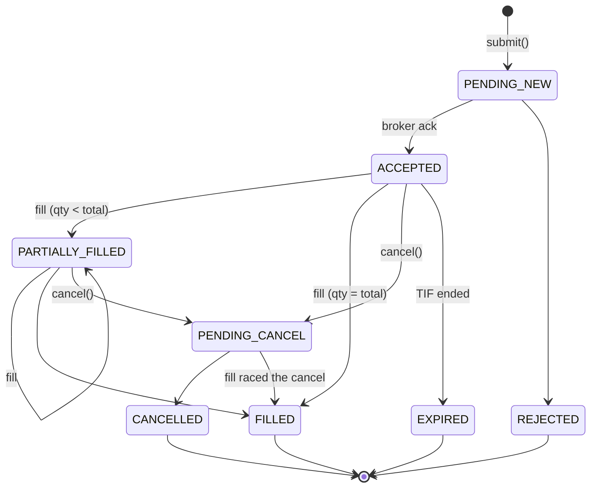

# Part 4 — Broker Connectivity & Trading Infrastructure: Detailed Lesson Plan

| Item | Detail |
|---|---|
| Program | Master in Financial Analysis and Algorithmic Trading (MFAAT) |
| Placement | Term 2, **Month 4** (program weeks 13–16) |
| Format | 16 sessions × 90 min (4 per week) + 4 lab clinics × 120 min + self-study (~6 hrs/week) |
| Total effort | ~24 hrs live + 8 hrs clinic + 24 hrs self-study ≈ **56 hours** |
| Brokers | Interactive Brokers (TWS / IB Gateway via `ib_async`) · Alpaca (`alpaca-py`) — **paper accounts only in this Part** |
| Platform milestone | **M1 Connectivity**: `BrokerAdapter` (IB, Alpaca, Sim), `DataHandler`, OMS v1, Kill Switch |
| Covers original items | "Advance with Python" 1–5, 39, 40 · Platform roadmap 3–6 |

---

## 1. Learning Objectives

By the end of Part 4 the learner will be able to:

1. **Configure** a reproducible Python trading environment (uv, JupyterLab, Docker, secrets) and run IB Gateway headless.
2. **Connect** to IB and Alpaca paper accounts, qualify instruments across asset classes, and read account, position and order state.
3. **Retrieve** historical and live market data from both brokers, respecting pacing and rate limits, and **normalize** it into one canonical, UTC-based schema.
4. **Design and implement** a resilient connection manager with reconnect/back-off, heartbeat and subscription recovery.
5. **Place, modify, cancel and track** all common order types (market, limit, stop, stop-limit, trailing, bracket, OCO) with idempotent client order IDs and an explicit order state machine.
6. **Reconcile** internal state with broker state on startup and continuously.
7. **Build and test** a kill switch that cancels all orders and flattens all positions within seconds on configurable triggers.
8. **Handle** equities, futures (multipliers, expiries, rolls), forex (pip values, IDEALPRO lots) and crypto correctly.
9. **Promote** notebook code into the `quantforge` library behind a broker-agnostic `BrokerAdapter` interface with contract tests.

---

## 2. Prerequisites

| From | Needed for |
|---|---|
| 1.3 Stock Market Basics (order types, sessions) | Sessions 10–12 |
| 1.4 Market Microstructure (bid/ask, NBBO, auctions) | Sessions 7, 10 |
| 1.5 Derivatives (futures specs, expiry, roll) | Session 14 |
| 3.2 Advanced Python (`asyncio`, type hints, dataclasses) | All sessions, critical for 9–11 |
| 3.3 OOP & 3.4 LLD (ABC, Adapter, State, Observer) | Sessions 8, 11, 16 |
| 3.6 Databases (Parquet, DuckDB, Redis) | Sessions 6, 8 |
| 3.7 Software craft (pytest, Docker, Git) | Sessions 1, 16 |
| Platform **M0** (domain models, config, logging) | All platform work |

**Accounts required before Week 1:** IBKR account with paper trading enabled (market-data sharing switched on from the live account), Alpaca account with paper API keys.

---

## 3. Weekly Overview

| Week | Theme | Sessions | Clinic Lab | Platform Output |
|---|---|---|---|---|
| **W1** | Environment & broker foundations | S1 Environment · S2 IB architecture · S3 `ib_async` core · S4 Alpaca core | Both brokers connected from one notebook | `brokers/base.py` interface draft |
| **W2** | Market data | S5 IB historical · S6 Alpaca historical + normalization · S7 Live streaming · S8 DataHandler | Download 2 years of 5-min bars for 20 symbols from both brokers, reconcile | `data/historical.py`, `data/live.py`, `data/store.py` |
| **W3** | Connections & orders | S9 Connection management · S10 Order types & mapping · S11 Order lifecycle & state machine · S12 Bracket/OCO, what-if, reconciliation | Bracket order lifecycle on both brokers with event log | `env/connections.py`, `domain/order.py`, `execution/oms.py` |
| **W4** | Safety, multi-asset, integration | S13 Kill switch · S14 Futures, FX, crypto · S15 Account constraints & risk pre-checks · S16 Integration & assessment | Kill-switch drill; end-to-end assessment dry run | `execution/killswitch.py`, adapter contract tests, **M1 release** |

---

## 4. Session-by-Session Plan

> Each session: **15 min recap/theory → 45 min live coding → 20 min guided lab → 10 min wrap-up and homework.**
> Notebooks live in `notebooks/part04/`; promoted code lives in `quantforge/`. Offline guided notebooks with self-checking exercises (8, one or two sessions each) are in [`notebooks/part04/`](../../notebooks/part04/), with instructor solutions in `notebooks/part04/solutions/`. Offline, auto-graded exercises for every week and the W3–W4 clinics, plus paper-account scripts for W1–W2, are in [`labs/part04/`](../../labs/part04/).

### Week 1 — Environment & Broker Foundations

#### S1 · Module 4.1 — Reproducible Trading Environment

**Objectives:** set up a project every later module builds on; never commit a secret.

| Block | Content |
|---|---|
| Theory | Why reproducibility matters in trading (a live bug you cannot reproduce is unfixable). Project layout; lockfiles; separating research (notebooks) from production (package). |
| Live coding | `uv init quantforge` → `pyproject.toml` with `ib_async`, `alpaca-py`, `pandas`, `polars`, `duckdb`, `pyarrow`, `pydantic-settings`, `exchange_calendars`, `pytest`, `ruff`, `mypy`; register a Jupyter kernel; `.env` + `pydantic-settings` config; `.gitignore` for `.env`, data and logs; `pre-commit` with `ruff` and a secret scanner (`detect-secrets` or `gitleaks`). |
| Lab | `01_env_check.ipynb`: prints versions, loads config, asserts no secrets are in the Git index. |
| Homework | Build the course Docker image (`python:3.12-slim` + uv) and run the test suite inside it. |

```python
# quantforge/core/config.py
from pydantic import SecretStr
from pydantic_settings import BaseSettings, SettingsConfigDict

class Settings(BaseSettings):
    model_config = SettingsConfigDict(env_file=".env", env_prefix="QF_")

    env: str = "paper"                  # paper | live | backtest
    ib_host: str = "127.0.0.1"
    ib_port: int = 4002                 # Gateway paper=4002, live=4001; TWS paper=7497, live=7496
    ib_client_id: int = 1
    alpaca_key: SecretStr
    alpaca_secret: SecretStr
    alpaca_paper: bool = True
```

#### S2 · Module 4.2a — Interactive Brokers Architecture

**Objectives:** understand what sits between your code and the exchange at IB.

| Block | Content |
|---|---|
| Theory | Architecture: your code ↔ TCP socket ↔ **TWS or IB Gateway** ↔ IB servers. TWS (GUI) vs Gateway (headless, lower resource use). Ports (4001/4002 Gateway, 7496/7497 TWS). **Client IDs**: each connection needs a unique ID; `clientId=0` can see manual TWS orders. API settings: enable socket clients, trusted IPs, read-only API toggle, "Download open orders on connection". Daily auto-restart and weekly re-authentication. Market-data subscriptions, and sharing them with the paper account. `ibapi` (official, callback-based) vs `ib_async` (maintained successor of `ib_insync`, asyncio-based, keeps state in sync automatically). |
| Live coding | Run IB Gateway in Docker with IBC for automated login (community image, credentials from env vars, paper mode); check the port with `nc -z`. |
| Lab | Start Gateway, connect from a notebook, print `ib.managedAccounts()`. |
| Homework | Read the TWS API "Initial Setup" and "Connectivity" docs; write a one-page diagram of the connection path. |

#### S3 · Module 4.2b — `ib_async` Core: Contracts, Account, Events

**Objectives:** model instruments correctly and understand the event-driven API.

| Block | Content |
|---|---|
| Theory | Contract types: `Stock`, `Index`, `Future`, `ContFuture`, `Option`, `FuturesOption`, `Forex`, `Crypto`, `CFD`. `SMART` routing vs a direct exchange; `primaryExchange` to remove ambiguity; `conId` as the unique key. `qualifyContracts` fills in `conId` and details. `reqContractDetails` gives `minTick`, trading hours, multiplier. Event model: `IB` keeps live collections (`positions()`, `openTrades()`, `fills()`) synced by events (`orderStatusEvent`, `execDetailsEvent`, `errorEvent`, `disconnectedEvent`, `pendingTickersEvent`). Sync vs async methods (`connect` vs `connectAsync`). In Jupyter, use `util.startLoop()` or the `*Async` methods with `await`. |
| Live coding | See below. |
| Lab | Qualify one contract per asset class; print `minTick`, `multiplier`, `tradingHours`. |
| Homework | Build `instrument_to_ib_contract(inst: Instrument) -> Contract` mapper with tests. |

```python
from ib_async import IB, Stock, Future, Forex, Index, Option, util

util.startLoop()                     # Jupyter only
ib = IB()
ib.connect("127.0.0.1", 4002, clientId=11, timeout=10)

contracts = [
    Stock("AAPL", "SMART", "USD", primaryExchange="NASDAQ"),
    Future("ES", "202612", "CME"),
    Forex("EURUSD"),
    Index("SPX", "CBOE"),
]
qualified = ib.qualifyContracts(*contracts)
for c in qualified:
    d = ib.reqContractDetails(c)[0]
    print(c.localSymbol, c.conId, d.minTick, c.multiplier)

summary = {v.tag: v.value for v in ib.accountSummary() if v.currency in ("USD", "BASE")}
print(summary["NetLiquidation"], summary["BuyingPower"])
ib.errorEvent += lambda reqId, code, msg, contract: print("IB error", code, msg)
```

#### S4 · Module 4.3 — Alpaca Core: Trading API, Data API, Accounts

**Objectives:** use the REST + WebSocket model and understand its differences from IB.

| Block | Content |
|---|---|
| Theory | No local gateway: HTTPS REST + WebSockets straight to Alpaca. Paper vs live endpoints and keys. SDK split: `TradingClient`, `StockHistoricalDataClient`, `CryptoHistoricalDataClient`, `OptionHistoricalDataClient`, `StockDataStream`, `TradingStream`. Data feeds: **IEX** (free, a single venue, a small share of volume) vs **SIP** (consolidated, paid for recent data). Rate limits (about 200 requests/min on the trading API; check your plan). Account fields: `equity`, `buying_power`, `pattern_day_trader`, `daytrade_count`, `trading_blocked`, `shorting_enabled`. Market clock and calendar. Asset flags: `tradable`, `shortable`, `easy_to_borrow`, `fractionable`. |
| Live coding | See below. |
| Lab | Print the account, the clock, the next 5 trading days, and flags for 10 symbols. |
| Homework | Write a comparison table of IB and Alpaca: connection model, data, order types, limits, assets. |

```python
from alpaca.trading.client import TradingClient
from alpaca.trading.requests import GetCalendarRequest
from quantforge.core.config import Settings

s = Settings()
tc = TradingClient(s.alpaca_key.get_secret_value(), s.alpaca_secret.get_secret_value(), paper=True)

acct = tc.get_account()
print(acct.equity, acct.buying_power, acct.pattern_day_trader, acct.daytrade_count)

clock = tc.get_clock()
print("open" if clock.is_open else f"opens {clock.next_open}")

from datetime import date, timedelta
days = tc.get_calendar(GetCalendarRequest(start=date.today(), end=date.today() + timedelta(days=10)))
print([d.date for d in days[:5]])

asset = tc.get_asset("AAPL")
print(asset.tradable, asset.shortable, asset.easy_to_borrow, asset.fractionable)
```

**Clinic W1 (120 min):** a single notebook connects to both brokers, prints account equity side by side, and disconnects cleanly. Troubleshooting: port/clientId conflicts, trusted IPs, key/endpoint mismatch.

---

### Week 2 — Market Data

#### S5 · Module 4.4a — Historical Data from IB

| Block | Content |
|---|---|
| Theory | `reqHistoricalData` parameters: `endDateTime`, `durationStr` (`"30 D"`, `"1 Y"`), `barSizeSetting` (`"1 min"`, `"5 mins"`, `"1 hour"`, `"1 day"`), `whatToShow` (`TRADES`, `MIDPOINT`, `BID`, `ASK`, `ADJUSTED_LAST`), `useRTH`, `formatDate=2` (UTC epoch). **Pacing rules:** no identical request within 15 s; no more than 6 requests for the same contract/exchange/tick type within 2 s; no more than 60 requests in any 10-minute window for small bars; limits on how far back each bar size goes. `reqHeadTimeStamp` gives the earliest available data. FX has no `TRADES`, so use `MIDPOINT`. Expired futures require `includeExpired=True`. |
| Live coding | A chunked downloader that walks `endDateTime` backwards, sleeps between requests to stay within pacing, and de-duplicates overlapping bars. |
| Lab | Download 1 year of 5-min AAPL `TRADES` bars and 1 year of EURUSD `MIDPOINT` bars; save to Parquet. |
| Homework | Add retry on error 162 (pacing / no data) with exponential back-off. |

```python
import asyncio, pandas as pd
from ib_async import util

async def ib_history(ib, contract, *, bar="5 mins", chunk="10 D", total_chunks=26,
                     what="TRADES", rth=True, pause=10.5) -> pd.DataFrame:
    end, frames = "", []
    for _ in range(total_chunks):
        bars = await ib.reqHistoricalDataAsync(
            contract, endDateTime=end, durationStr=chunk, barSizeSetting=bar,
            whatToShow=what, useRTH=rth, formatDate=2)
        if not bars:
            break
        df = util.df(bars)
        frames.append(df)
        end = df["date"].min()           # next chunk ends where this one started
        await asyncio.sleep(pause)       # stay under the 60-requests / 10-minute pacing limit
    out = pd.concat(frames).drop_duplicates("date").sort_values("date")
    return out.rename(columns={"date": "ts"}).reset_index(drop=True)
```

#### S6 · Module 4.4b — Alpaca Historical Data & the Canonical Schema

| Block | Content |
|---|---|
| Theory | `StockBarsRequest`, `CryptoBarsRequest`; `TimeFrame(5, TimeFrameUnit.Minute)`; `feed=DataFeed.IEX` vs `SIP`; `adjustment=Adjustment.ALL` for splits and dividends; automatic pagination; the multi-index `(symbol, timestamp)` DataFrame. **Normalization:** one canonical bar schema for every source (below). Bar timestamps mark the bar **open**, in **UTC**. Trading calendars with `exchange_calendars` (XNYS) to detect missing sessions. Survivorship bias and delisted symbols. Storage: partitioned Parquet (`source/symbol/timeframe/year=`) queried with DuckDB. |
| Live coding | Alpaca download → normalize → write Parquet → DuckDB query across both sources. |
| Lab | For 5 symbols, compare IB and Alpaca (IEX) daily volume and close; explain the differences (single venue vs consolidated feed, adjustment). |
| Homework | Write `validate_bars(df)`: monotonic timestamps, OHLC consistency (`low ≤ open,close ≤ high`), no negative volume, gap report against the calendar. |

| Column | Type | Notes |
|---|---|---|
| `ts` | `datetime64[ns, UTC]` | Bar open time |
| `symbol` | `str` | Canonical symbol (`AAPL`, `ESZ6`, `EUR.USD`, `BTC/USD`) |
| `open`, `high`, `low`, `close` | `float64` | |
| `volume` | `float64` | `NaN` for FX midpoint |
| `vwap`, `trade_count` | `float64` | Optional |
| `timeframe` | `str` | `1m`, `5m`, `1h`, `1d` |
| `source` | `str` | `ib`, `alpaca_iex`, `alpaca_sip` |
| `adjusted` | `bool` | Corporate-action adjusted? |

```python
from datetime import datetime, timezone
from alpaca.data.historical import StockHistoricalDataClient
from alpaca.data.requests import StockBarsRequest
from alpaca.data.timeframe import TimeFrame, TimeFrameUnit
from alpaca.data.enums import DataFeed, Adjustment

dc = StockHistoricalDataClient(key, secret)
req = StockBarsRequest(
    symbol_or_symbols=["AAPL", "MSFT"],
    timeframe=TimeFrame(5, TimeFrameUnit.Minute),
    start=datetime(2025, 1, 1, tzinfo=timezone.utc),
    end=datetime(2025, 12, 31, tzinfo=timezone.utc),
    feed=DataFeed.IEX, adjustment=Adjustment.ALL,
)
df = dc.get_stock_bars(req).df.reset_index().rename(columns={"timestamp": "ts"})
df["timeframe"], df["source"], df["adjusted"] = "5m", "alpaca_iex", True
```

#### S7 · Module 4.4c — Live Streaming Data

| Block | Content |
|---|---|
| Theory | **IB:** `reqMktData` → `Ticker` (bid/ask/last/size, updated through `pendingTickersEvent`); generic ticks (for example `236` for shortable shares); `reqMarketDataType` 1 = live, 2 = frozen, 3 = delayed, 4 = delayed-frozen; `reqRealTimeBars` (5-second bars); `reqHistoricalData(..., keepUpToDate=True)` for streaming bars; market-data line limits. **Alpaca:** `StockDataStream` / `CryptoDataStream` with `subscribe_trades/quotes/bars`; async handlers; limit on concurrent connections per account. **Jupyter caveat:** `stream.run()` starts its own event loop, so run it in a background thread in notebooks. **Bar builder:** aggregate ticks into bars yourself for consistent timestamps across sources. |
| Live coding | Stream SPY quotes from both brokers into one `asyncio.Queue`; a `BarBuilder` turns trades into 1-minute bars. |
| Lab | Measure the delay between exchange timestamp and receive time per source; plot the distribution. |
| Homework | Make `BarBuilder` emit a bar at the minute boundary even when no trade arrives (timer driven). |

```python
from dataclasses import dataclass
from datetime import datetime, timedelta

@dataclass
class _Acc:
    start: datetime; o: float; h: float; l: float; c: float; v: float

class BarBuilder:
    """Aggregates trade ticks into fixed-interval bars (timestamps = bar open, UTC)."""
    def __init__(self, interval: timedelta, on_bar):
        self.interval, self.on_bar, self._acc = interval, on_bar, None

    def _floor(self, ts: datetime) -> datetime:
        epoch = datetime(1970, 1, 1, tzinfo=ts.tzinfo)
        return ts - ((ts - epoch) % self.interval)

    def on_trade(self, ts: datetime, price: float, size: float) -> None:
        start = self._floor(ts)
        a = self._acc
        if a and start > a.start:
            self.on_bar(a)
            a = None
        if a is None:
            self._acc = _Acc(start, price, price, price, price, size)
        else:
            a.h, a.l, a.c, a.v = max(a.h, price), min(a.l, price), price, a.v + size
```

#### S8 · Module 4.7 — Helper File: the Unified `DataHandler`

| Block | Content |
|---|---|
| Theory | **One interface for backtest and live**: strategies never know where bars come from. Repository pattern for storage; read-through cache (check Parquet, fetch the missing range, write back); resampling rules (`first/max/min/last/sum`); gap filling policy (never forward-fill prices in live trading without flagging it); warm-up (history + live stitched without duplicates). |
| Live coding | Promote code into `quantforge/data/` (below). |
| Lab | `get_bars("AAPL", "5m", start, end)` pulls from cache or broker transparently; `subscribe_bars` starts with warm-up history and continues live. |
| Homework | Unit tests with a `FakeFeed`: cache hit, partial cache, gap detection, warm-up stitching. |

```python
# quantforge/data/handler.py
class DataHandler:
    def __init__(self, store: BarStore, sources: dict[str, HistoricalSource], live: LiveSource): ...
    async def get_bars(self, inst: Instrument, timeframe: str,
                       start: datetime, end: datetime, source: str | None = None) -> pl.DataFrame: ...
    async def subscribe_bars(self, inst: Instrument, timeframe: str,
                             warmup: int = 200) -> AsyncIterator[Bar]: ...
    def resample(self, df: pl.DataFrame, timeframe: str) -> pl.DataFrame: ...
```

**Clinic W2:** build a 20-symbol × 2-year 5-min dataset from both brokers, run `validate_bars`, and write a one-page data-quality report.

---

### Week 3 — Connections & Orders

#### S9 · Module 4.5 — Connection Management

| Block | Content |
|---|---|
| Theory | Failure taxonomy: process down, network drop, gateway restart, broker-side disconnect, auth expiry, rate limiting. **IB system codes:** `1100` connectivity lost, `1101` restored with data lost (resubscribe), `1102` restored with data kept, `2104/2106/2158` farm OK (informational), `326` client ID in use, `502`/`504` cannot connect / not connected. **Alpaca:** HTTP `429` (rate limited), `401/403` (auth), WebSocket close and reconnect, `connection limit exceeded`. Patterns: exponential back-off with jitter, circuit breaker, heartbeat/stale-data watchdog, subscription registry for replay after reconnect, token-bucket rate limiter. `ib_async` also ships a `Watchdog` that works with IBC. |
| Live coding | See below, then a chaos test: kill the Gateway container during streaming and watch the recovery. |
| Lab | Log every connection state transition; prove subscriptions resume after a forced disconnect. |
| Homework | Implement `CircuitBreaker` (closed → open → half-open) around Alpaca REST calls. |

```python
# quantforge/env/connections.py
import asyncio, random, logging, time
log = logging.getLogger(__name__)

async def with_backoff(connect, *, base=1.0, cap=60.0, max_tries=None):
    attempt = 0
    while True:
        try:
            return await connect()
        except (ConnectionError, OSError, asyncio.TimeoutError) as e:
            attempt += 1
            if max_tries and attempt >= max_tries:
                raise
            delay = min(cap, base * 2 ** attempt) * random.uniform(0.5, 1.0)
            log.warning("connect failed (%s); retry %d in %.1fs", e, attempt, delay)
            await asyncio.sleep(delay)

class TokenBucket:
    """Async rate limiter: `rate` tokens per second, burst up to `capacity`."""
    def __init__(self, rate: float, capacity: int):
        self.rate, self.capacity, self.tokens, self.t = rate, capacity, float(capacity), time.monotonic()
        self._lock = asyncio.Lock()

    async def acquire(self) -> None:
        async with self._lock:
            while True:
                now = time.monotonic()
                self.tokens = min(self.capacity, self.tokens + (now - self.t) * self.rate)
                self.t = now
                if self.tokens >= 1:
                    self.tokens -= 1
                    return
                await asyncio.sleep((1 - self.tokens) / self.rate)

class IBConnection:
    def __init__(self, ib, host, port, client_id, subscriptions):
        self.ib, self.args, self.subs = ib, (host, port, client_id), subscriptions
        ib.disconnectedEvent += self._on_disconnect
        ib.errorEvent += self._on_error

    async def start(self):
        host, port, cid = self.args
        await with_backoff(lambda: self.ib.connectAsync(host, port, clientId=cid, timeout=10))
        await self.subs.replay(self.ib)                # restore market-data subscriptions

    def _on_disconnect(self):
        log.error("IB disconnected; reconnecting")
        asyncio.ensure_future(self.start())

    def _on_error(self, req_id, code, msg, contract):
        if code == 1101:                                # restored, data lost
            asyncio.ensure_future(self.subs.replay(self.ib))
```

#### S10 · Module 4.6a — Order Types & Cross-Broker Mapping

| Block | Content |
|---|---|
| Theory | Order anatomy: side, quantity, type, limit/stop price, time-in-force, session, client order ID. **Idempotency:** generate the client order ID *before* sending; on a timeout, query by that ID instead of re-sending (prevents duplicate orders). IB `orderId` is per session and per client, so store your own ID in `order.orderRef`. Alpaca `client_order_id` (unique, up to 128 characters). **Price validity:** round to `minTick` (IB); Alpaca rejects sub-penny prices on stocks priced ≥ $1. Extended hours: IB `outsideRth=True`; Alpaca `extended_hours=True` (limit + DAY only). |
| Live coding | A canonical `Order` domain model → IB `Order` and Alpaca request mappers, using the mapping table below. |
| Lab | Submit, then cancel, each order type on both paper accounts; record the broker responses. |
| Homework | Property-based test (`hypothesis`): every canonical order maps to a valid broker order or raises `UnsupportedOrder` — never silently changes meaning. |

| Canonical | IB (`ib_async`) | Alpaca (`alpaca-py`) |
|---|---|---|
| Market | `MarketOrder(action, qty)` | `MarketOrderRequest` |
| Limit | `LimitOrder(action, qty, px)` | `LimitOrderRequest(limit_price=px)` |
| Stop | `StopOrder(action, qty, stop)` | `StopOrderRequest(stop_price=stop)` |
| Stop-limit | `StopLimitOrder(action, qty, lmt, stop)` | `StopLimitOrderRequest(limit_price, stop_price)` |
| Trailing stop | `Order(orderType="TRAIL", trailingPercent=…)` or `auxPrice` (amount) | `TrailingStopOrderRequest(trail_percent=…)` or `trail_price` |
| Bracket | `ib.bracketOrder(...)` → parent + TP + SL | `order_class=OrderClass.BRACKET` + `take_profit` + `stop_loss` |
| OCO | `ib.oneCancelsAll(orders, group, ocaType)` | `order_class=OrderClass.OCO` (exit legs for an existing position) |
| OTO | parent + child with `parentId`, `transmit` flags | `order_class=OrderClass.OTO` |
| TIF | `tif="DAY" / "GTC" / "IOC" / "OPG"` | `TimeInForce.DAY / GTC / IOC / FOK / OPG / CLS` |
| Client ID | `order.orderRef` | `client_order_id` |

```python
# quantforge/domain/order.py
from dataclasses import dataclass, field
from decimal import Decimal
from enum import Enum
import uuid

class Side(str, Enum): BUY = "BUY"; SELL = "SELL"
class OrdType(str, Enum): MARKET = "MKT"; LIMIT = "LMT"; STOP = "STP"; STOP_LIMIT = "STP_LMT"; TRAIL = "TRAIL"
class TIF(str, Enum): DAY = "DAY"; GTC = "GTC"; IOC = "IOC"; FOK = "FOK"

@dataclass(frozen=True)
class OrderRequest:
    instrument: "Instrument"
    side: Side
    qty: Decimal
    type: OrdType
    limit_price: Decimal | None = None
    stop_price: Decimal | None = None
    trail_percent: Decimal | None = None
    tif: TIF = TIF.DAY
    extended_hours: bool = False
    strategy_id: str = "manual"
    client_order_id: str = field(default_factory=lambda: f"qf-{uuid.uuid4().hex[:20]}")
```

#### S11 · Module 4.6b — Order Lifecycle, State Machine & Update Streams

| Block | Content |
|---|---|
| Theory | Why a state machine: brokers send events out of order, duplicated, or after a reconnect. Canonical states and **legal transitions only**; unknown transitions are logged and trigger a reconciliation instead of crashing. Status mapping below. **Fills are the truth:** position = sum of executions (IB `execDetailsEvent`, Alpaca `fill`/`partial_fill` trade updates), not order status. Duplicate suppression by execution ID. Cancel/replace: IB modifies by re-placing with the same `orderId`; Alpaca `replace_order_by_id` creates a new order linked to the old one. |
| Live coding | State pattern + event handlers for both brokers publishing `OrderUpdate` onto the event bus. |
| Lab | Place a limit order far from the market, modify it twice, cancel it; show the full event log and final state from both brokers. |
| Homework | Test suite feeding shuffled and duplicated event sequences into the state machine. |



| Canonical | IB `orderStatus.status` | Alpaca `order.status` / trade-update event |
|---|---|---|
| PENDING_NEW | `PendingSubmit`, `ApiPending` | `pending_new`, `accepted` |
| ACCEPTED | `PreSubmitted`, `Submitted` | `new` |
| PARTIALLY_FILLED | `Submitted` with `filled > 0` | `partially_filled` / `partial_fill` |
| FILLED | `Filled` (remaining = 0) | `filled` / `fill` |
| PENDING_CANCEL | `PendingCancel` | `pending_cancel` |
| CANCELLED | `Cancelled`, `ApiCancelled` | `canceled` |
| REJECTED | `Inactive` (+ error code) | `rejected` |
| EXPIRED | `Cancelled` at end of TIF | `expired`, `done_for_day` |

```python
# Alpaca trade updates (run in a background thread inside Jupyter)
from alpaca.trading.stream import TradingStream
import threading

ts = TradingStream(key, secret, paper=True)

async def on_update(data):                        # data.event: new, fill, partial_fill, canceled...
    bus.publish(OrderUpdate.from_alpaca(data))

ts.subscribe_trade_updates(on_update)
threading.Thread(target=ts.run, daemon=True).start()

# IB order + execution events
ib.orderStatusEvent += lambda trade: bus.publish(OrderUpdate.from_ib(trade))
ib.execDetailsEvent += lambda trade, fill: bus.publish(FillEvent.from_ib(fill))
```

#### S12 · Module 4.6c — Bracket, OCO, Margin What-If & Reconciliation

| Block | Content |
|---|---|
| Theory | **Bracket orders:** entry + take-profit + stop-loss. IB: the child legs carry `parentId` and are sent with `transmit=False` until the last leg (`ib.bracketOrder` does this for you). Alpaca: a single request with `order_class=BRACKET`; the legs appear as `legs` on the parent. OCO for exits on an existing position. **Margin what-if** (IB `whatIfOrder`) returns initial/maintenance margin change *before* sending. **Reconciliation:** on startup and every N seconds compare internal orders/positions with `ib.openTrades()`/`ib.positions()` and `tc.get_orders()`/`tc.get_all_positions()`; broker state wins; log and alert every difference. |
| Live coding | See below. |
| Lab | Bracket on SPY on both brokers; move the stop to breakeven after +0.5R; confirm the OCO behavior when one leg fills. |
| Homework | `Reconciler` class with a report: orders only we know about, orders only the broker knows about, quantity mismatches. |

```python
# IB bracket with margin preview
from ib_async import Stock
spy = ib.qualifyContracts(Stock("SPY", "SMART", "USD"))[0]
last = ib.reqTickers(spy)[0].marketPrice()      # needs a data subscription; NaN when no data
br = ib.bracketOrder("BUY", 10, limitPrice=round(last - 0.10, 2),
                     takeProfitPrice=round(last + 2.00, 2), stopLossPrice=round(last - 1.00, 2))
what_if = ib.whatIfOrder(spy, br.parent)
print("init margin change:", what_if.initMarginChange)
for o in br:
    o.orderRef = "qf-demo-001"
    ib.placeOrder(spy, o)

# Alpaca bracket
from alpaca.trading.requests import LimitOrderRequest, TakeProfitRequest, StopLossRequest
from alpaca.trading.enums import OrderSide, TimeInForce, OrderClass
req = LimitOrderRequest(
    symbol="SPY", qty=10, side=OrderSide.BUY, time_in_force=TimeInForce.DAY,
    limit_price=round(last - 0.10, 2), order_class=OrderClass.BRACKET,
    take_profit=TakeProfitRequest(limit_price=round(last + 2.00, 2)),
    stop_loss=StopLossRequest(stop_price=round(last - 1.00, 2)),
    client_order_id="qf-demo-001",
)
order = tc.submit_order(req)
```

**Clinic W3:** run a bracket order end to end on both brokers, export the event log as JSON, and replay it through the state machine to prove the final states match.

---

### Week 4 — Safety, Multi-Asset & Integration

#### S13 · Module 4.8 — Kill Switch

| Block | Content |
|---|---|
| Theory | Real incidents where no kill switch was available (Knight Capital 2012). Requirements: **fast** (< 5 s to cancel all), **idempotent** (safe to trip twice), **sticky** (stays tripped across restarts until a human resets it), **independent** (works even if the strategy engine is stuck), **audited**. Triggers: daily loss limit, drawdown from intraday peak, order rate above N/min, reject rate, stale data > T seconds, broker disconnected > T seconds, position limit breach, manual (CLI, HTTP endpoint, Telegram or n8n webhook). Actions: block new orders → cancel all (IB `reqGlobalCancel`, Alpaca `cancel_orders`) → optionally flatten (IB market orders per position, Alpaca `close_all_positions(cancel_orders=True)`) → notify. |
| Live coding | See below. |
| Lab | **Drill:** open 3 positions and 5 working orders per broker, trip the switch, and measure the time until the account is flat. |
| Homework | Add a separate watchdog process that trips the switch if the main process heartbeat stops. |

```python
# quantforge/execution/killswitch.py
import asyncio, json, time
from pathlib import Path

class KillSwitch:
    def __init__(self, adapters: list["BrokerAdapter"], notifier, state_file=Path("state/killswitch.json")):
        self.adapters, self.notifier, self.state_file = adapters, notifier, state_file
        self._lock = asyncio.Lock()

    @property
    def tripped(self) -> bool:
        return self.state_file.exists() and json.loads(self.state_file.read_text())["tripped"]

    def guard(self) -> None:
        """Called by the OMS before every submit."""
        if self.tripped:
            raise RuntimeError("Kill switch tripped: new orders blocked")

    async def trip(self, reason: str, flatten: bool = True) -> None:
        async with self._lock:
            self.state_file.parent.mkdir(parents=True, exist_ok=True)
            self.state_file.write_text(json.dumps({"tripped": True, "reason": reason, "ts": time.time()}))
            t0 = time.monotonic()
            await asyncio.gather(*(a.cancel_all() for a in self.adapters), return_exceptions=True)
            if flatten:
                await asyncio.gather(*(a.flatten_all() for a in self.adapters), return_exceptions=True)
            await self.notifier.send(f"KILL SWITCH: {reason} ({time.monotonic() - t0:.2f}s)")

    def reset(self, operator: str) -> None:
        self.state_file.write_text(json.dumps({"tripped": False, "reset_by": operator, "ts": time.time()}))
```

#### S14 · Module 4.9a — Futures, Forex & Crypto Specifics

| Block | Content |
|---|---|
| Theory | **Futures (IB):** contract month codes (H M U Z), `lastTradeDateOrContractMonth`, multiplier (ES 50, MES 5, NQ 20, CL 1000), tick value = `minTick × multiplier`; roll timing (volume/open-interest crossover, or N days before expiry); `ContFuture` for continuous historical data only (you cannot trade it); first notice vs last trade date. **Forex (IB IDEALPRO):** `Forex("EURUSD")`, orders in base-currency units, IDEALPRO minimum around 25,000 base units (smaller sizes are odd lots with worse execution), pip value = pip size × units converted to account currency, `MIDPOINT` data, 24×5 sessions. **Crypto (Alpaca):** `BTC/USD` symbols, 24/7, fractional quantities, TIF `GTC`/`IOC`, no shorting. |
| Live coding | `contract_value()`, `pip_value()`, `next_roll_date()` helpers with tests. |
| Lab | Trade 1 MES and 25,000 EURUSD on IB paper, and 0.001 BTC/USD on Alpaca paper; reconcile P&L in USD. |
| Homework | Roll a paper MES position from the front month to the next with a calendar-spread (combo `BAG`) order. |

```python
def pip_value_usd(pair: str, units: float, usd_per_quote: float) -> float:
    """Value of one pip in USD. JPY pairs use a 0.01 pip; others 0.0001."""
    pip = 0.01 if pair.endswith("JPY") else 0.0001
    return pip * units * usd_per_quote          # value in quote currency converted to USD

def futures_pnl(entry: float, exit: float, qty: int, multiplier: float) -> float:
    return (exit - entry) * qty * multiplier
```

#### S15 · Module 4.9b — Account Constraints & Pre-Trade Checks

| Block | Content |
|---|---|
| Theory | Broker-enforced rules your code must respect: cash vs margin accounts; buying power and margin (IB `whatIfOrder`, Alpaca `buying_power`); pattern-day-trader flags (Alpaca `pattern_day_trader`, `daytrade_count`; confirm the broker's current PDT policy); short availability (IB generic tick 236, Alpaca `shortable`/`easy_to_borrow`); market-data entitlements (IB error 354 means no subscription; 10167 means delayed data is shown); trading halts and LULD bands; session hours per instrument. Where these checks go: a **pre-trade check chain** in the OMS (full risk engine arrives in Part 8). |
| Live coding | A `PreTradeChecks` chain: instrument tradable → session open → price sane vs last (fat-finger band) → quantity ≤ max → buying power sufficient → shortable when selling short → kill switch not tripped. |
| Lab | Try to break it: fat-finger price, short a hard-to-borrow stock, order outside hours, order above buying power; each must be rejected with a clear reason. |
| Homework | Add a per-strategy max-notional check and a max-orders-per-minute check. |

#### S16 · Integration, Contract Tests & Assessment Brief

| Block | Content |
|---|---|
| Theory | Contract testing: one test suite that every `BrokerAdapter` (IB, Alpaca, Sim) must pass. Fakes vs mocks vs paper-account integration tests (marked `@pytest.mark.paper`, never run in CI). Release checklist for **M1**. |
| Live coding | See below. |
| Lab | Run the contract suite against `SimAdapter` in CI and against both paper adapters locally. |
| Homework | Final assessment project (Section 8). |

```python
# tests/contract/test_broker_adapter.py
# requires pytest-asyncio (asyncio_mode = "auto")
import os
import pytest
from decimal import Decimal
from quantforge.core.errors import DuplicateOrder

ADAPTERS = ["sim"] + (["ib", "alpaca"] if os.getenv("QF_PAPER_TESTS") == "1" else [])

@pytest.fixture(params=ADAPTERS)
async def adapter(request, adapter_factory):
    a = adapter_factory(request.param)
    await a.connect()
    yield a
    await a.cancel_all()
    await a.disconnect()

async def test_submit_and_cancel_limit(adapter, far_limit_buy):
    oid = await adapter.submit(far_limit_buy)
    await adapter.cancel(far_limit_buy.client_order_id)
    final = await adapter.wait_for_state(far_limit_buy.client_order_id, {"CANCELLED"}, timeout=15)
    assert final.filled_qty == Decimal(0)

async def test_duplicate_client_order_id_is_not_sent_twice(adapter, far_limit_buy):
    await adapter.submit(far_limit_buy)
    with pytest.raises(DuplicateOrder):
        await adapter.submit(far_limit_buy)
```

**Clinic W4:** assessment dry run plus code review of each learner's M1 pull request.

---

## 5. Notebook Map (`notebooks/part04/`)

> The table below is the notebook map for the platform build (connected to paper accounts). The offline **guided** notebooks in [`notebooks/part04/`](../../notebooks/part04/) cover the same sessions in 8 notebooks: `01_env_config_secrets` (S1–S2), `02_contracts_and_accounts` (S3–S4), `03_historical_data` (S5–S6), `04_live_bars_and_cache` (S7–S8), `05_connections` (S9), `06_order_mapping` (S10), `07_order_lifecycle` (S11–S12), `08_safety_multiasset` (S13–S16).

| Notebook | Session | Promoted to |
|---|---|---|
| `01_env_check.ipynb` | S1 | `core/config.py` |
| `02_ib_gateway_connect.ipynb` | S2 | `env/connections.py` |
| `03_ib_contracts_account.ipynb` | S3 | `brokers/ib/contracts.py` |
| `04_alpaca_account_clock.ipynb` | S4 | `brokers/alpaca/client.py` |
| `05_ib_historical_downloader.ipynb` | S5 | `data/sources/ib.py` |
| `06_alpaca_historical_normalize.ipynb` | S6 | `data/sources/alpaca.py`, `data/clean.py` |
| `07_live_streams_barbuilder.ipynb` | S7 | `data/live.py` |
| `08_datahandler.ipynb` | S8 | `data/handler.py`, `data/store.py` |
| `09_connection_chaos.ipynb` | S9 | `env/connections.py` |
| `10_order_mapping.ipynb` | S10 | `domain/order.py`, `brokers/*/mapper.py` |
| `11_order_state_machine.ipynb` | S11 | `domain/order_state.py`, `execution/oms.py` |
| `12_bracket_whatif_reconcile.ipynb` | S12 | `execution/reconcile.py` |
| `13_killswitch_drill.ipynb` | S13 | `execution/killswitch.py` |
| `14_futures_fx_crypto.ipynb` | S14 | `domain/instrument.py`, `lib/helpers.py` |
| `15_pretrade_checks.ipynb` | S15 | `execution/pretrade.py` |
| `16_contract_tests.ipynb` | S16 | `tests/contract/` |

---

## 6. Common Mistakes & How to Catch Them

| # | Mistake | Symptom | Detection / Fix |
|---|---|---|---|
| 1 | Two processes use the same IB `clientId` | Error `326`, random disconnects | Allocate client IDs from config per process; assert at startup |
| 2 | Blocking calls (`time.sleep`, sync HTTP) inside async handlers | Frozen streams, missed fills | Use `asyncio.sleep` / `ib.sleep`; enable asyncio debug mode to flag slow callbacks |
| 3 | Re-sending an order after a timeout | Duplicate positions | Idempotent client order IDs; query by ID before any retry |
| 4 | Treating order status as position truth | Position drift | Build positions from executions; reconcile against the broker |
| 5 | Naive or local timestamps | Misaligned bars, look-ahead in backtests | Enforce `tz=UTC` in schema validation |
| 6 | `TRADES` data requested for FX | Empty result or error | Use `MIDPOINT` for FX; per-asset-class defaults in the mapper |
| 7 | Ignoring IB pacing | Error `162`, temporary bans | Pacing-aware downloader; request queue with token bucket |
| 8 | Comparing IEX volume to consolidated volume | Wrong volume signals | Record `source` in every bar; do not mix feeds within a strategy |
| 9 | Prices not rounded to tick size | Rejected orders | Round to `minTick` (IB) / penny rules (Alpaca) in the mapper |
| 10 | Calling `stream.run()` in Jupyter | "event loop is already running" | Run Alpaca streams in a background thread or a separate script |
| 11 | API keys in notebooks or Git | Leaked credentials | `.env` + `SecretStr` + pre-commit secret scanning |
| 12 | Kill switch that depends on the strategy loop | Cannot stop a hung strategy | Separate watchdog process + sticky state file |
| 13 | Trusting paper fills | Over-optimistic results | Record paper vs expected slippage; treat paper as a plumbing test, not a performance test |
| 14 | Trading `ContFuture` | Order rejected | Use `ContFuture` only for data; trade the specific contract month |

---

## 7. Exercises

**Basic**
1. Print account equity, cash and buying power from both brokers in one table.
2. Download 6 months of daily bars for 10 ETFs from Alpaca and save them as partitioned Parquet.
3. Place and cancel a limit order on each broker; print every status update received.

**Intermediate**
4. Build an IB historical downloader that resumes after a crash (checkpoint the last `endDateTime`).
5. Stream quotes for 5 symbols from both brokers; compute the live mid-price difference between feeds.
6. Implement trailing-stop management client-side (update the stop every bar) and compare it with the broker-native trailing stop.

**Advanced**
7. Implement `SimAdapter` with a configurable latency, partial-fill and reject model that passes the full contract test suite.
8. Build a reconciliation daemon that runs every 30 s, auto-cancels orphan orders tagged with your prefix, and alerts on position mismatches.

**Open research question**
9. Measure order acknowledgement latency (submit → broker ack) and fill latency for marketable limit orders on both paper accounts over one week. How does it vary by time of day, and what does this imply for strategies with holding periods under 5 minutes?

---

## 8. Assessment — Platform Milestone M1

**Task:** a single entry point `python -m quantforge.apps.cli demo --broker {ib,alpaca,sim}` that:

1. Connects with retry and logs every connection state change.
2. Warms up 200 five-minute bars of SPY via `DataHandler`, then streams live bars.
3. On the next bar close, places a **bracket order** (limit entry, take profit +2R, stop −1R) with an idempotent client order ID, after passing the pre-trade checks.
4. Moves the stop to breakeven at +1R.
5. Survives a forced disconnect (Gateway restart / network drop) and reconciles state.
6. Trips the kill switch on command and leaves the account flat with no working orders.
7. Writes a JSON event log that replays to the same final state.

| Criterion | Points |
|---|---|
| Works identically on IB paper, Alpaca paper and Sim (same strategy code) | 20 |
| Correct order lifecycle and state machine (including partial fills, cancel race) | 15 |
| Connection resilience + reconciliation demonstrated live | 15 |
| Kill switch: < 5 s, sticky, idempotent, audited | 15 |
| Data layer: canonical schema, UTC, validation, cache | 10 |
| Contract tests + unit tests (≥ 85% coverage on new code), CI green | 10 |
| Code quality: typing (`mypy --strict`), SOLID, no secrets, clear logs | 10 |
| Short write-up: design decisions and known limitations | 5 |
| **Total** | **100** |

Pass mark: 70, **and** the kill-switch drill must pass (mandatory).

---

## 9. Further Reading

| Type | Reference |
|---|---|
| Docs | Interactive Brokers, *TWS API Documentation* (connectivity, orders, historical data limitations, error codes) |
| Docs | `ib_async` documentation and examples (ib-api-reloaded project) |
| Docs | Alpaca, *Trading API*, *Market Data API* and `alpaca-py` SDK reference |
| Book | Harris, L. (2003). *Trading and Exchanges: Market Microstructure for Practitioners*. Oxford University Press. |
| Book | Hilpisch, Y. (2020). *Python for Algorithmic Trading*. O'Reilly. |
| Book | Percival, H. & Gregory, B. (2020). *Architecture Patterns with Python*. O'Reilly. |
| Book | Hattingh, C. (2020). *Using Asyncio in Python*. O'Reilly. |
| Case study | SEC (2013). Administrative proceeding on Knight Capital Americas LLC (August 1, 2012 trading incident). |

---

## 10. Instructor Notes

- Test every live-coding cell against current SDK versions the week before teaching; both SDKs change often. Pin versions in `uv.lock`.
- Keep a pre-recorded fallback of each live demo in case paper servers or market hours are not available (many sessions run outside US market hours; use Alpaca crypto streams for live demos then).
- Stagger IB `clientId` ranges per learner (e.g. learner *n* uses `100n`–`100n+9`) when sharing a Gateway in the lab.
- No live-money trading in Part 4. Live access is unlocked only after the Part 8 risk engine passes review.
